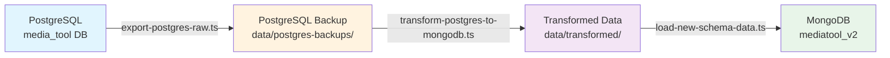
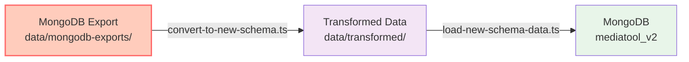

# ETL Workflow Diagram

## Primary Pipeline: PostgreSQL → MongoDB



## Data Flow Detail

```
┌─────────────────────┐
│   PostgreSQL DB     │
│   (media_tool)      │
│                     │
│ Tables:             │
│ • campaigns (13k)   │
│ • users (326)       │
│ • accounts (9.8k)   │
│ • strategies (13k)  │
│ • line_items (4k)   │
└──────────┬──────────┘
           │
           │ export-postgres-raw.ts
           ▼
┌─────────────────────┐
│ PostgreSQL Backup   │
│ /data/postgres-     │
│ backups/2025-06-27/ │
│                     │
│ • All 20 fields     │
│ • 848,937 records   │
│ • 924 MB total      │
└──────────┬──────────┘
           │
           │ transform-postgres-to-mongodb.ts
           ▼
┌─────────────────────┐
│ Transformation      │
│                     │
│ • budget → price    │
│ • impressions →     │
│   units             │
│ • margin split      │
│ • team structure    │
│   updated           │
└──────────┬──────────┘
           │
           │ load-new-schema-data.ts
           ▼
┌─────────────────────┐
│    MongoDB DB       │
│   (mediatool_v2)    │
│                     │
│ Collections:        │
│ • campaigns         │
│   (new schema)      │
└─────────────────────┘
```

## Secondary Pipeline: MongoDB → MongoDB



**⚠️ Warning**: MongoDB exports are missing fields and should only be used when PostgreSQL data is unavailable.

## Key Transformations

### Field Mappings

| Source (PostgreSQL) | Target (MongoDB)           | Type       |
| ------------------- | -------------------------- | ---------- |
| `budget`            | `price.targetAmount`       | number     |
| `campaign_id`       | `campaignId`               | string     |
| `campaign_number`   | `campaignNumber`           | string     |
| `campaign_name`     | `name`                     | string     |
| `stage`             | `status`                   | enum       |
| N/A                 | `price.actualAmount`       | calculated |
| N/A                 | `price.remainingAmount`    | calculated |
| N/A                 | `metrics.marginAmount`     | calculated |
| N/A                 | `metrics.marginPercentage` | calculated |
| `impressions`       | `metrics.units`            | number     |

### Status Mapping

```javascript
{
  'Closed (Lost)': 'L3',
  'Closed (Won)': 'L3',
  'Active': 'L2',
  'Pending': 'L1'
}
```

## File Structure

```
bravo-1/
├── data/
│   ├── postgres-backups/
│   │   └── 2025-06-27/          # ✅ Canonical source
│   │       ├── campaigns.json
│   │       ├── users.json
│   │       └── ...
│   ├── mongodb-exports/
│   │   ├── 2025-06-18/          # ⚠️ Missing fields
│   │   └── 2025-06-22/          # ⚠️ Missing fields
│   └── transformed/
│       ├── 2025-06-27-postgres/
│       │   └── campaigns-from-postgres.json
│       └── 2025-06-18-mongodb/
│           └── campaigns-new-schema.json
└── scripts/
    ├── postgres-export/
    │   └── export-postgres-raw.ts
    └── etl/
        ├── transform-postgres-to-mongodb.ts
        ├── convert-to-new-schema.ts
        └── load-new-schema-data.ts
```
